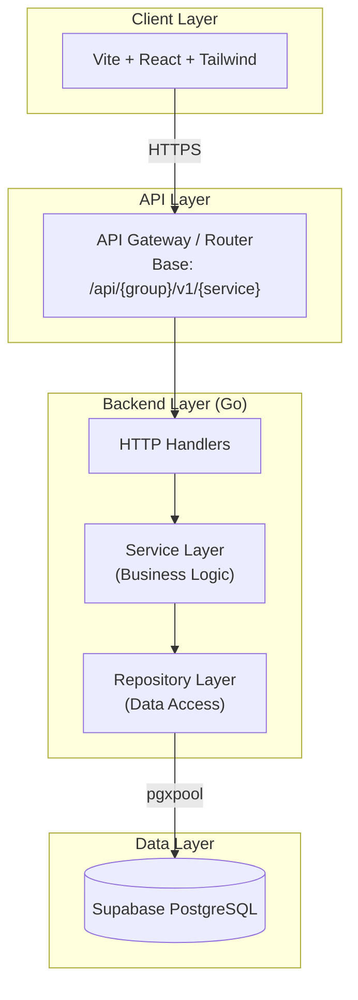
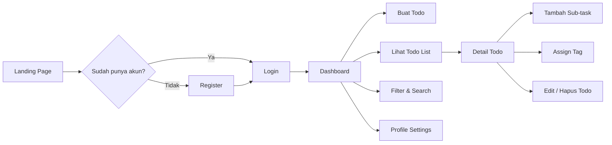

# Donezo — Overview

## 1. Apa itu Donezo?

Donezo adalah aplikasi manajemen tugas (todo app) yang dirancang untuk membantu pengguna mengatur, melacak, dan menyelesaikan tugas harian secara efisien. Aplikasi ini menargetkan pengguna personal maupun tim kecil yang membutuhkan solusi sederhana namun powerful untuk manajemen produktivitas.

## 2. Visi & Tujuan

| Aspek           | Deskripsi                                                                                               |
| --------------- | ------------------------------------------------------------------------------------------------------- |
| **Visi**        | Menjadi aplikasi todo yang paling intuitif dan dapat diskalakan untuk pengguna individual dan tim kecil |
| **Misi**        | Menyederhanakan manajemen tugas tanpa mengorbankan fitur-fitur esensial                                 |
| **Target User** | Freelancer, professional, tim kecil (2-10 orang), personal productivity enthusiast                      |

## 3. Fitur Utama (MVP)

### 3.1 Authentication & Authorization

- **Register**: Pendaftaran akun baru dengan email dan password
- **Login**: Autentikasi dengan JWT (JSON Web Token)
- **Logout**: Penghapusan session/token
- **Refresh Token**: Mekanisme refresh token untuk keamanan yang lebih baik
- **User Profile**: Pengelolaan data pribadi pengguna

### 3.2 Todo Management

- **Create Todo**: Membuat tugas baru dengan judul, deskripsi, tanggal jatuh tempo, prioritas, dan status
- **Read Todo**: Melihat detail tugas termasuk sub-tasks dan tags
- **Update Todo**: Mengubah informasi tugas yang sudah ada
- **Delete Todo**: Menghapus tugas (soft delete atau hard delete)
- **Bulk Operations**: Operasi massal seperti mark as completed/uncompleted

### 3.3 Sub-task Management

- **Create Sub-task**: Menambahkan checklist item dalam satu todo
- **Toggle Completion**: Menandai sub-task sebagai selesai atau belum
- **Reorder**: Mengurutkan ulang sub-tasks (opsional)

### 3.4 Tag & Kategori

- **Create Tag**: Membuat label dengan nama dan warna
- **Assign Tag**: Menghubungkan tag ke todo
- **Filter by Tag**: Menyaring todo berdasarkan tag

### 3.5 Filter, Search & Pagination

- **Filter**: Berdasarkan status, prioritas, tanggal jatuh tempo, tag
- **Search**: Pencarian berdasarkan judul todo
- **Sort**: Pengurutan berdasarkan tanggal dibuat, prioritas, tanggal jatuh tempo
- **Pagination**: Server-side pagination dengan metadata lengkap

## 4. Tech Stack

### 4.1 Backend

| Komponen        | Teknologi      | Alasan Pemilihan                                              |
| --------------- | -------------- | ------------------------------------------------------------- |
| Bahasa          | Go 1.22+       | Performa tinggi, concurrency model yang baik, kompilasi cepat |
| Framework HTTP  | Gin atau Echo  | Ringan, performa tinggi, middleware ecosystem yang kaya       |
| Database Driver | pgx/v5         | Native PostgreSQL driver dengan connection pooling            |
| Auth            | golang-jwt     | Library JWT yang mature dan teruji                            |
| Validation      | validator/v10  | Validasi struct dengan tag, mendukung custom validation       |
| Migration       | golang-migrate | Versioned database migrations                                 |

### 4.2 Frontend

| Komponen         | Teknologi                      | Alasan Pemilihan                                         |
| ---------------- | ------------------------------ | -------------------------------------------------------- |
| Build Tool       | Vite                           | Hot reload cepat, bundle size optimal                    |
| Framework        | React 18+                      | Ecosystem besar, komponen reusable                       |
| Language         | TypeScript                     | Type safety, autocomplete, refactoring yang aman         |
| Styling          | Tailwind CSS                   | Utility-first, konsisten, tidak perlu menulis CSS custom |
| State Management | Zustand                        | Ringan, minimal boilerplate, TypeScript-friendly         |
| Data Fetching    | React Query / SWR              | Caching, background refetch, optimistic updates          |
| Testing          | Vitest + React Testing Library | Unit test cepat, testing approach yang user-centric      |

### 4.3 Database & Infrastructure

| Komponen         | Teknologi                  | Alasan Pemilihan                            |
| ---------------- | -------------------------- | ------------------------------------------- |
| Database         | PostgreSQL (Supabase)      | Relational, ACID compliant, managed service |
| Hosting Backend  | TBD (Render, Railway, VPS) | Fleksibel sesuai kebutuhan                  |
| Hosting Frontend | Vercel / Netlify           | Deploy otomatis dari Git                    |

## 5. Arsitektur Singkat



## 6. Alur Pengguna (User Flow)



## 7. Skalabilitas & Future Considerations

| Aspek                  | Saat Ini                | Future                              |
| ---------------------- | ----------------------- | ----------------------------------- |
| **Auth**               | JWT stateless           | OAuth2 / SSO integration            |
| **Database**           | Single Supabase project | Read replicas, connection pooling   |
| **Real-time**          | Polling (opsional)      | Supabase Realtime / WebSocket       |
| **Storage**            | Avatar URL eksternal    | Supabase Storage untuk upload file  |
| **Notifications**      | -                       | Push notifications, email reminders |
| **Team Collaboration** | Single user             | Shared todos, team workspaces       |

## 8. Kebijakan Keamanan

- **Password**: Hash dengan bcrypt (cost factor ≥ 10)
- **JWT**: Secret key minimal 256-bit, access token TTL 15-60 menit, refresh token TTL 7 hari
- **CORS**: Strict origin whitelist
- **Input Validation**: Server-side validation untuk semua input
- **SQL Injection**: Parameterized queries via pgx
- **Rate Limiting**: Implementasi rate limiter pada auth endpoints

## 9. Konvensi & Standar

### 9.1 Response Envelope

Semua response API mengikuti format standar:

**Sukses:**

```json
{
  "message": "string",
  "code": int,
  "result": {}
}
```

**Error:**

```json
{
  "message": "string",
  "code": int,
  "error": "string"
}
```

**Pagination (dalam result):**

```json
{
  "data": [],
  "metadata": {
    "current_page": 1,
    "page_size": 10,
    "total_pages": 10,
    "total_records": 100,
    "has_next": true,
    "has_prev": false
  }
}
```

### 9.2 API Base URL

```
/api/{group-service}/v1/{service}
```

Contoh:

- `/api/auth/v1/register`
- `/api/todos/v1/list`
- `/api/users/v1/profile`

## 10. Definisi Istilah

| Istilah        | Definisi                                                                                   |
| -------------- | ------------------------------------------------------------------------------------------ |
| **Todo**       | Satu unit tugas yang memiliki judul, deskripsi, status, prioritas, dan tanggal jatuh tempo |
| **Sub-task**   | Item checklist dalam satu todo yang dapat ditandai selesai secara independen               |
| **Tag**        | Label kategorisasi yang dapat diberikan pada todo untuk pengelompokan                      |
| **Status**     | Kondisi todo: `pending`, `in_progress`, `completed`, `cancelled`                           |
| **Priority**   | Tingkat kepentingan: `low`, `medium`, `high`, `urgent`                                     |
| **Pagination** | Pembagian data menjadi halaman-halaman dengan metadata navigasi                            |
