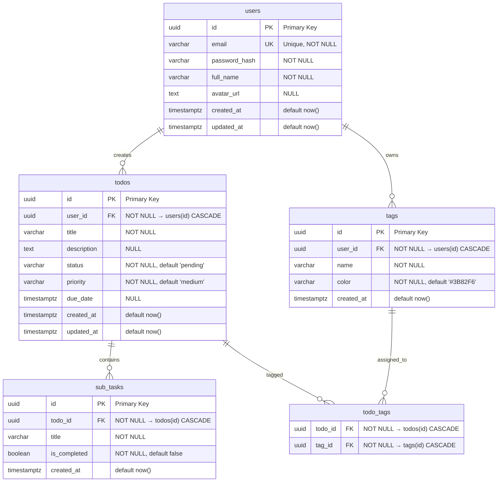
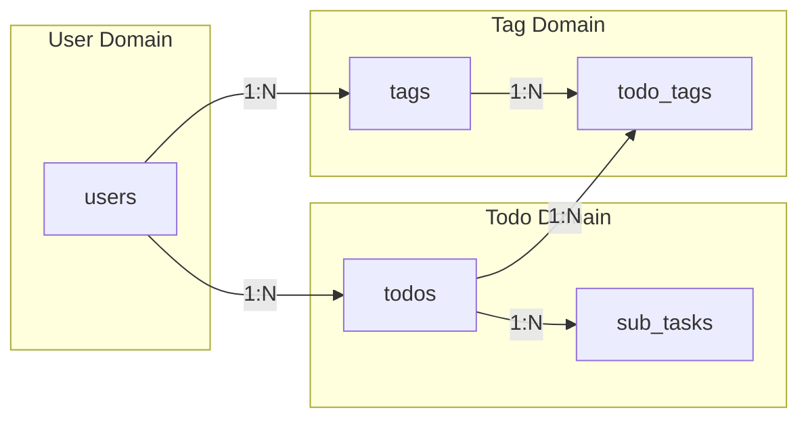

# Donezo — Database Design

## 1. Entity Relationship Diagram



## 2. Schema Detail

### 2.1 Table: `users`

Menyimpan informasi akun pengguna aplikasi.

| Column          | Type           | Constraint         | Default             | Deskripsi                                     |
| --------------- | -------------- | ------------------ | ------------------- | --------------------------------------------- |
| `id`            | `UUID`         | `PRIMARY KEY`      | `gen_random_uuid()` | Identifier unik pengguna                      |
| `email`         | `VARCHAR(255)` | `NOT NULL, UNIQUE` | -                   | Alamat email pengguna (digunakan untuk login) |
| `password_hash` | `VARCHAR(255)` | `NOT NULL`         | -                   | Hash password (bcrypt)                        |
| `full_name`     | `VARCHAR(100)` | `NOT NULL`         | -                   | Nama lengkap pengguna                         |
| `avatar_url`    | `TEXT`         | `NULL`             | -                   | URL gambar avatar pengguna                    |
| `created_at`    | `TIMESTAMPTZ`  | `NOT NULL`         | `now()`             | Waktu pembuatan akun                          |
| `updated_at`    | `TIMESTAMPTZ`  | `NOT NULL`         | `now()`             | Waktu terakhir diperbarui                     |

**Constraint Tambahan:**

- `CHECK (email ~* '^[A-Za-z0-9._%+-]+@[A-Za-z0-9.-]+\.[A-Za-z]{2,}$')` — validasi format email

**Catatan:**

- Password tidak pernah disimpan dalam bentuk plain text. Selalu di-hash menggunakan bcrypt dengan cost factor minimal 10.
- `updated_at` diperbarui secara otomatis via trigger atau di-handle oleh aplikasi.

---

### 2.2 Table: `todos`

Menyimpan data tugas utama yang dibuat oleh pengguna.

| Column        | Type           | Constraint              | Default             | Deskripsi                              |
| ------------- | -------------- | ----------------------- | ------------------- | -------------------------------------- |
| `id`          | `UUID`         | `PRIMARY KEY`           | `gen_random_uuid()` | Identifier unik todo                   |
| `user_id`     | `UUID`         | `NOT NULL, FOREIGN KEY` | -                   | Pemilik todo (referensi ke `users.id`) |
| `title`       | `VARCHAR(255)` | `NOT NULL`              | -                   | Judul tugas                            |
| `description` | `TEXT`         | `NULL`                  | -                   | Deskripsi/detail tugas                 |
| `status`      | `VARCHAR(20)`  | `NOT NULL`              | `'pending'`         | Status tugas                           |
| `priority`    | `VARCHAR(10)`  | `NOT NULL`              | `'medium'`          | Tingkat prioritas                      |
| `due_date`    | `TIMESTAMPTZ`  | `NULL`                  | -                   | Tanggal jatuh tempo                    |
| `created_at`  | `TIMESTAMPTZ`  | `NOT NULL`              | `now()`             | Waktu pembuatan todo                   |
| `updated_at`  | `TIMESTAMPTZ`  | `NOT NULL`              | `now()`             | Waktu terakhir diperbarui              |

**Enum Values:**

| Column     | Nilai yang Diperbolehkan | Deskripsi               |
| ---------- | ------------------------ | ----------------------- |
| `status`   | `pending`                | Tugas belum dikerjakan  |
|            | `in_progress`            | Tugas sedang dikerjakan |
|            | `completed`              | Tugas sudah selesai     |
|            | `cancelled`              | Tugas dibatalkan        |
| `priority` | `low`                    | Prioritas rendah        |
|            | `medium`                 | Prioritas sedang        |
|            | `high`                   | Prioritas tinggi        |
|            | `urgent`                 | Prioritas mendesak      |

**Constraint Tambahan:**

- `CHECK (status IN ('pending', 'in_progress', 'completed', 'cancelled'))`
- `CHECK (priority IN ('low', 'medium', 'high', 'urgent'))`
- `ON DELETE CASCADE` pada `user_id`

**Catatan:**

- Satu user dapat memiliki banyak todo (one-to-many).
- Soft delete tidak diimplementasikan di MVP; penghapusan bersifat permanen.

---

### 2.3 Table: `sub_tasks`

Menyimpan item checklist dalam satu todo.

| Column         | Type           | Constraint              | Default             | Deskripsi                            |
| -------------- | -------------- | ----------------------- | ------------------- | ------------------------------------ |
| `id`           | `UUID`         | `PRIMARY KEY`           | `gen_random_uuid()` | Identifier unik sub-task             |
| `todo_id`      | `UUID`         | `NOT NULL, FOREIGN KEY` | -                   | Todo induk (referensi ke `todos.id`) |
| `title`        | `VARCHAR(255)` | `NOT NULL`              | -                   | Judul sub-task                       |
| `is_completed` | `BOOLEAN`      | `NOT NULL`              | `false`             | Status penyelesaian                  |
| `created_at`   | `TIMESTAMPTZ`  | `NOT NULL`              | `now()`             | Waktu pembuatan sub-task             |

**Constraint Tambahan:**

- `ON DELETE CASCADE` pada `todo_id`

**Catatan:**

- Satu todo dapat memiliki banyak sub-task (one-to-many).
- Sub-task tidak memiliki kolom `updated_at` karena perubahan yang mungkin terjadi hanya pada `is_completed` dan `title` — jika diperlukan tracking lengkap, dapat ditambahkan di iterasi berikutnya.

---

### 2.4 Table: `tags`

Menyimpan label/kategori yang dimiliki oleh pengguna.

| Column       | Type          | Constraint              | Default             | Deskripsi                             |
| ------------ | ------------- | ----------------------- | ------------------- | ------------------------------------- |
| `id`         | `UUID`        | `PRIMARY KEY`           | `gen_random_uuid()` | Identifier unik tag                   |
| `user_id`    | `UUID`        | `NOT NULL, FOREIGN KEY` | -                   | Pemilik tag (referensi ke `users.id`) |
| `name`       | `VARCHAR(50)` | `NOT NULL`              | -                   | Nama tag                              |
| `color`      | `VARCHAR(7)`  | `NOT NULL`              | `'#3B82F6'`         | Warna tag dalam format hex            |
| `created_at` | `TIMESTAMPTZ` | `NOT NULL`              | `now()`             | Waktu pembuatan tag                   |

**Constraint Tambahan:**

- `UNIQUE (user_id, name)` — satu user tidak boleh memiliki tag dengan nama yang sama
- `CHECK (color ~* '^#[0-9A-Fa-f]{6}$')` — validasi format hex color
- `ON DELETE CASCADE` pada `user_id`

**Catatan:**

- Tag bersifat personal per user; tidak ada tag global.
- Warna default adalah biru (`#3B82F6`).

---

### 2.5 Table: `todo_tags` (Junction Table)

Menyimpan relasi many-to-many antara todo dan tag.

| Column    | Type   | Constraint                  | Default | Deskripsi               |
| --------- | ------ | --------------------------- | ------- | ----------------------- |
| `todo_id` | `UUID` | `NOT NULL, FOREIGN KEY, PK` | -       | Referensi ke `todos.id` |
| `tag_id`  | `UUID` | `NOT NULL, FOREIGN KEY, PK` | -       | Referensi ke `tags.id`  |

**Constraint Tambahan:**

- `PRIMARY KEY (todo_id, tag_id)` — composite primary key
- `ON DELETE CASCADE` pada kedua foreign key

**Catatan:**

- Satu todo dapat memiliki banyak tag.
- Satu tag dapat diberikan ke banyak todo.
- Tidak ada kolom tambahan (seperti `created_at`) karena ini adalah pure junction table.

---

## 3. Relasi Antar Tabel



| Relasi                | Tipe             | Deskripsi                                                                                      |
| --------------------- | ---------------- | ---------------------------------------------------------------------------------------------- |
| `users` → `todos`     | **One-to-Many**  | Satu user dapat memiliki banyak todo                                                           |
| `users` → `tags`      | **One-to-Many**  | Satu user dapat memiliki banyak tag                                                            |
| `todos` → `sub_tasks` | **One-to-Many**  | Satu todo dapat memiliki banyak sub-task                                                       |
| `todos` ↔ `tags`      | **Many-to-Many** | Satu todo dapat memiliki banyak tag; satu tag dapat diberikan ke banyak todo (via `todo_tags`) |

---

## 4. Indexes

Indexes dirancang untuk mengoptimalkan query yang paling sering digunakan.

### 4.1 Table: `todos`

| Index Name                     | Columns                      | Tipe                                  | Tujuan                      |
| ------------------------------ | ---------------------------- | ------------------------------------- | --------------------------- |
| `idx_todos_user_id_status`     | `user_id`, `status`          | B-Tree                                | Filter list todo by status  |
| `idx_todos_user_id_due_date`   | `user_id`, `due_date`        | B-Tree                                | Sort & filter by due date   |
| `idx_todos_user_id_priority`   | `user_id`, `priority`        | B-Tree                                | Filter by priority          |
| `idx_todos_user_id_created_at` | `user_id`, `created_at DESC` | B-Tree                                | Default sort (newest first) |
| `idx_todos_user_id_title`      | `user_id`, `title`           | B-Tree (opsional: GIN dengan pg_trgm) | Search by title             |

### 4.2 Table: `sub_tasks`

| Index Name              | Columns   | Tipe   | Tujuan                  |
| ----------------------- | --------- | ------ | ----------------------- |
| `idx_sub_tasks_todo_id` | `todo_id` | B-Tree | Fetch sub-tasks by todo |

### 4.3 Table: `tags`

| Index Name              | Columns           | Tipe   | Tujuan                                                      |
| ----------------------- | ----------------- | ------ | ----------------------------------------------------------- |
| `idx_tags_user_id_name` | `user_id`, `name` | B-Tree | Unique tag per user (sudah tercover oleh UNIQUE constraint) |

### 4.4 Table: `todo_tags`

| Index Name              | Columns   | Tipe   | Tujuan                 |
| ----------------------- | --------- | ------ | ---------------------- |
| `idx_todo_tags_todo_id` | `todo_id` | B-Tree | Lookup tags for a todo |
| `idx_todo_tags_tag_id`  | `tag_id`  | B-Tree | Lookup todos by tag    |

---

## 5. Migration Strategy

### 5.1 Tools

- **golang-migrate**: Versioned migrations dengan up/down scripts
- **Format**: `YYYYMMDDHHMMSS_nama_migration.up.sql` dan `.down.sql`

### 5.2 Urutan Migration

```
000001_create_users_table.up.sql
000002_create_todos_table.up.sql
000003_create_sub_tasks_table.up.sql
000004_create_tags_table.up.sql
000005_create_todo_tags_table.up.sql
000006_create_indexes.up.sql
```

### 5.3 Contoh Migration Script

**000001_create_users_table.up.sql:**

```sql
CREATE EXTENSION IF NOT EXISTS "pgcrypto";

CREATE TABLE users (
    id UUID PRIMARY KEY DEFAULT gen_random_uuid(),
    email VARCHAR(255) NOT NULL UNIQUE,
    password_hash VARCHAR(255) NOT NULL,
    full_name VARCHAR(100) NOT NULL,
    avatar_url TEXT,
    created_at TIMESTAMPTZ NOT NULL DEFAULT now(),
    updated_at TIMESTAMPTZ NOT NULL DEFAULT now(),
    CONSTRAINT chk_users_email_format CHECK (email ~* '^[A-Za-z0-9._%+-]+@[A-Za-z0-9.-]+\.[A-Za-z]{2,}$')
);
```

**000001_create_users_table.down.sql:**

```sql
DROP TABLE IF EXISTS users;
```

---

## 6. Data Integrity & Constraints

### 6.1 Foreign Key Behavior

| Tabel       | Foreign Key            | On Delete | On Update | Alasan                             |
| ----------- | ---------------------- | --------- | --------- | ---------------------------------- |
| `todos`     | `user_id` → `users.id` | `CASCADE` | `CASCADE` | Hapus todo ketika user dihapus     |
| `sub_tasks` | `todo_id` → `todos.id` | `CASCADE` | `CASCADE` | Hapus sub-task ketika todo dihapus |
| `tags`      | `user_id` → `users.id` | `CASCADE` | `CASCADE` | Hapus tag ketika user dihapus      |
| `todo_tags` | `todo_id` → `todos.id` | `CASCADE` | `CASCADE` | Hapus relasi ketika todo dihapus   |
| `todo_tags` | `tag_id` → `tags.id`   | `CASCADE` | `CASCADE` | Hapus relasi ketika tag dihapus    |

### 6.2 Validasi Data

| Tabel   | Constraint               | Deskripsi                                |
| ------- | ------------------------ | ---------------------------------------- |
| `users` | `chk_users_email_format` | Format email harus valid                 |
| `todos` | `chk_todos_status`       | Status harus dalam enum yang diizinkan   |
| `todos` | `chk_todos_priority`     | Priority harus dalam enum yang diizinkan |
| `tags`  | `unique (user_id, name)` | Nama tag unik per user                   |
| `tags`  | `chk_tags_color_format`  | Format warna harus hex 6 digit           |

---

## 7. Trigger (Opsional)

### 7.1 Auto-update `updated_at`

Trigger untuk secara otomatis memperbarui kolom `updated_at` setiap kali row di-update.

```sql
CREATE OR REPLACE FUNCTION update_updated_at_column()
RETURNS TRIGGER AS $$
BEGIN
    NEW.updated_at = now();
    RETURN NEW;
END;
$$ language 'plpgsql';

CREATE TRIGGER update_users_updated_at BEFORE UPDATE ON users
    FOR EACH ROW EXECUTE FUNCTION update_updated_at_column();

CREATE TRIGGER update_todos_updated_at BEFORE UPDATE ON todos
    FOR EACH ROW EXECUTE FUNCTION update_updated_at_column();
```

**Catatan:** Trigger ini opsional. Alternatifnya, `updated_at` dapat di-handle oleh aplikasi Go saat melakukan UPDATE query.

---

## 8. Backup & Recovery

Karena menggunakan Supabase (managed PostgreSQL):

| Aspek                      | Detail                                               |
| -------------------------- | ---------------------------------------------------- |
| **Automated Backups**      | Supabase menyediakan daily backups (tergantung tier) |
| **Point-in-Time Recovery** | Tersedia di tier Pro ke atas                         |
| **Manual Export**          | Gunakan `pg_dump` untuk backup manual                |
| **Disaster Recovery**      | Restore dari backup Supabase console                 |

---

## 9. Performance Considerations

| Aspek                  | Strategi                                                                |
| ---------------------- | ----------------------------------------------------------------------- |
| **Connection Pooling** | pgxpool dengan max 25 open connections, 10 idle connections             |
| **Query Optimization** | Gunakan EXPLAIN ANALYZE untuk review query lambat                       |
| **N+1 Problem**        | Hindari dengan JOIN query untuk fetch todo + sub-tasks + tags sekaligus |
| **Full-text Search**   | Pertimbangkan `pg_trgm` extension untuk search title yang lebih baik    |
| **Pagination**         | Selalu gunakan LIMIT/OFFSET dengan ORDER BY yang terindeks              |
