# Donezo — Architecture

## 1. High-Level System Architecture

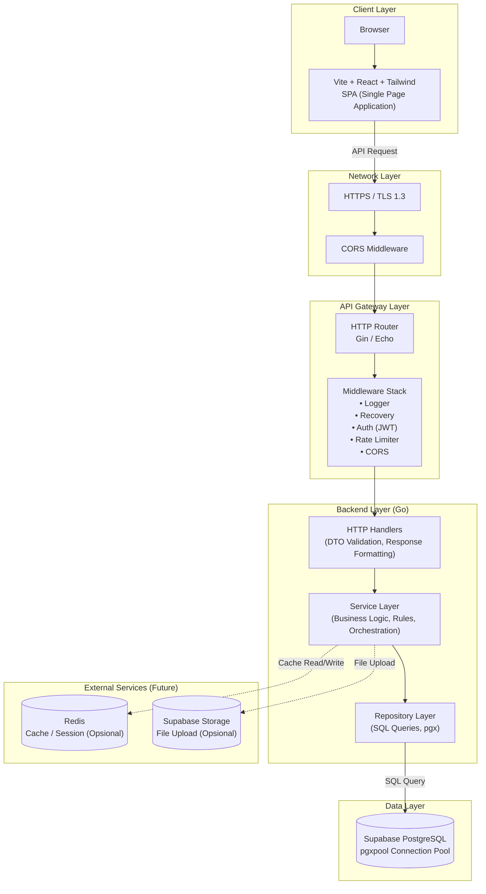

## 2. Backend Layer Architecture (Go)

Backend mengikuti prinsip **Clean Architecture** dengan interface-driven design. Setiap layer hanya bergantung pada interface dari layer di bawahnya, bukan implementasi konkret.

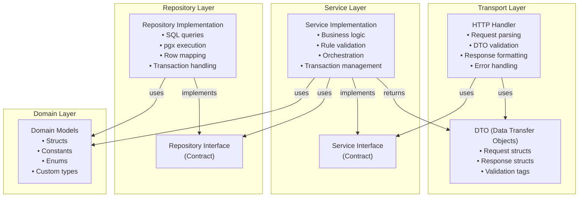

### 2.1 Layer Responsibilities

| Layer | Tanggung Jawab | Tidak Boleh |
|-------|-----------------|-------------|
| **Transport (Handler)** | Menerima HTTP request, parse input, validasi DTO, format response, handle HTTP-specific concerns | Tidak boleh mengandung business logic |
| **Service** | Menjalankan business logic, validasi aturan bisnis, orkestrasi antar repository, transaction management | Tidak boleh langsung query database |
| **Repository** | Eksekusi query SQL, mapping row ke struct, transaction handling di level database | Tidak boleh mengandung business logic |
| **Domain** | Definisi struct, constant, enum, custom types | Tidak boleh bergantung pada framework/library external |

### 2.2 Dependency Rule

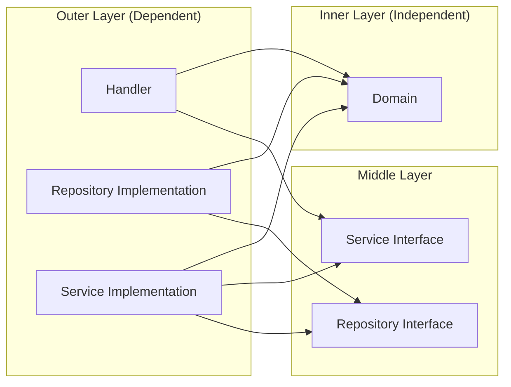

**Aturan:** Dependency mengalir ke dalam (inward). Domain layer tidak bergantung pada layer lain. Interface didefinisikan di layer yang menggunakannya (Dependency Inversion Principle).

---

## 3. Request Lifecycle

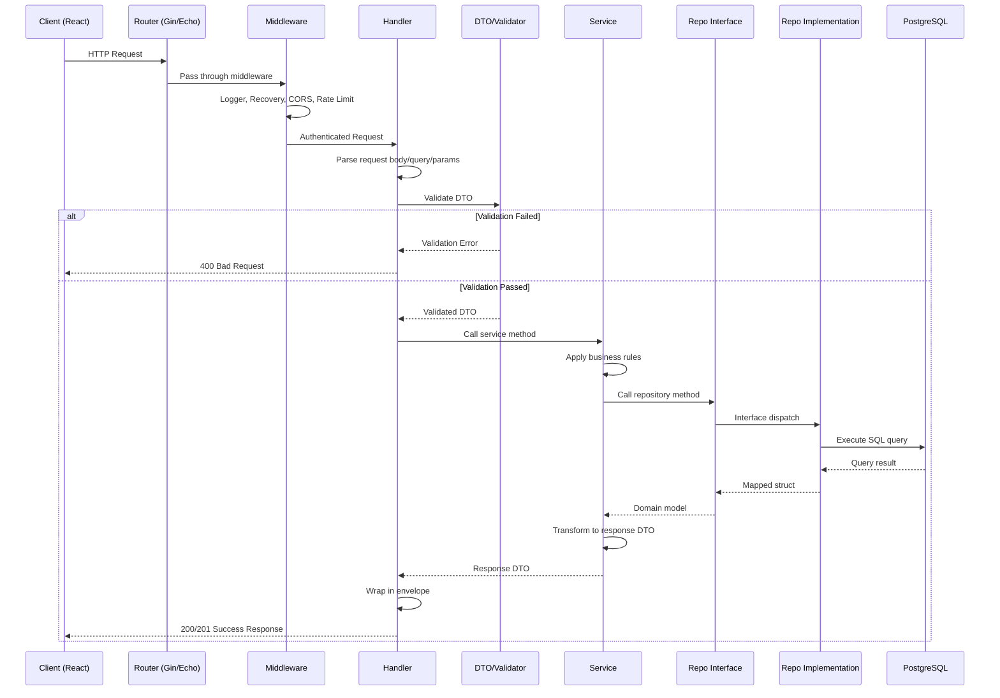

---

## 4. Dependency Injection Flow

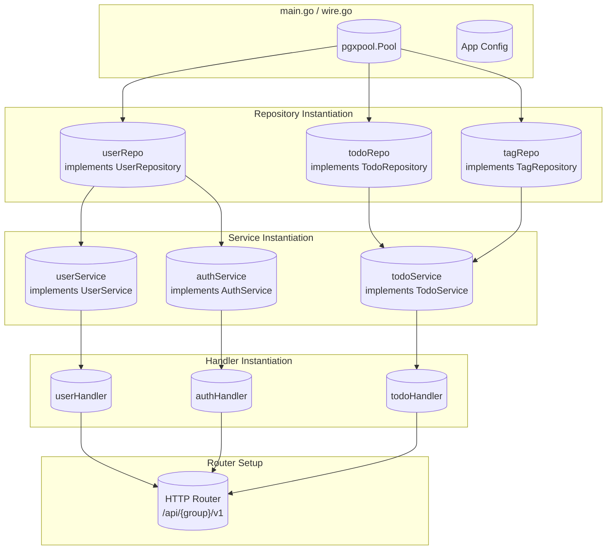

---

## 5. Authentication Flow

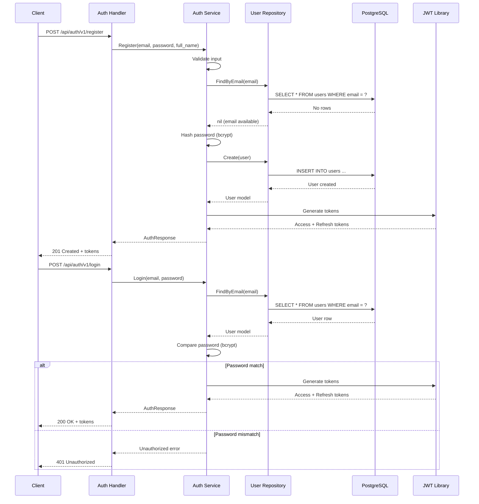

---

## 6. API URL Structure

```
/api/{group-service}/v1/{resource}
```

| Group | Base Path | Resources |
|-------|-----------|-----------|
| **Auth** | `/api/auth/v1` | `/register`, `/login`, `/refresh`, `/logout` |
| **Users** | `/api/users/v1` | `/profile`, `/profile/update` |
| **Todos** | `/api/todos/v1` | `/`, `/:id`, `/:id/sub-tasks` |
| **Tags** | `/api/tags/v1` | `/`, `/:id` |

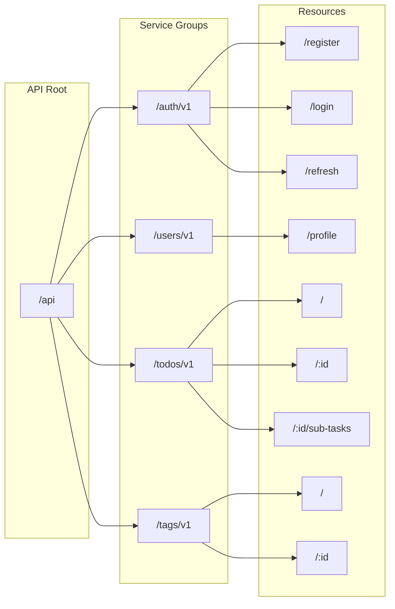

---

## 7. Middleware Stack

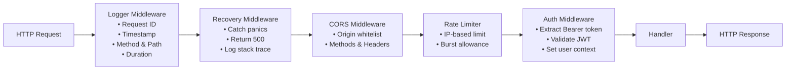

| Middleware | Urutan | Fungsi |
|------------|--------|--------|
| **Logger** | 1 | Log setiap request dengan detail (method, path, status, duration) |
| **Recovery** | 2 | Tangkap panic, prevent server crash, return 500 |
| **CORS** | 3 | Handle cross-origin requests sesuai whitelist |
| **Rate Limiter** | 4 | Batasi jumlah request per IP (khususnya auth endpoints) |
| **Auth (JWT)** | 5 | Validasi token, extract claims, set user context |

---

## 8. Error Handling Strategy

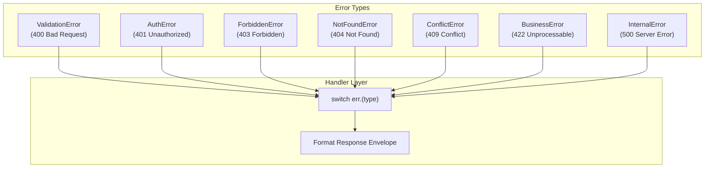

### 8.1 Error Mapping

| Error Type | HTTP Status | Contoh |
|------------|-------------|--------|
| `ValidationError` | `400` | Field required, invalid format |
| `AuthError` | `401` | Token invalid, token expired |
| `ForbiddenError` | `403` | Mengakses todo orang lain |
| `NotFoundError` | `404` | Todo tidak ditemukan |
| `ConflictError` | `409` | Email sudah terdaftar |
| `BusinessError` | `422` | Business rule violation |
| `InternalError` | `500` | Database error, unexpected error |

---

## 9. Key Architectural Decisions

| Keputusan | Implementasi | Alasan |
|-----------|-------------|--------|
| **Interface-driven** | Service & Repository menggunakan interface | Mudah mock untuk unit test; swap implementasi tanpa ubah business logic |
| **No ORM** | Raw SQL dengan pgx + scany (opsional) | Kontrol penuh query, performa optimal, kurva belajar rendah |
| **pgxpool** | Connection pooling built-in pgx | Performa tinggi, async notifications, native PostgreSQL |
| **JWT Stateless** | Access + Refresh token | API stateless, scalable horizontal, tidak perlu session store di MVP |
| **Supabase PostgreSQL** | Managed database | RLS siap aktif, backups otomatis, real-time potential |
| **Clean Architecture** | Layered dengan dependency inversion | Testable, maintainable, tidak terikat framework |
| **DTO Pattern** | Separate request/response structs | Decouple domain model dari API contract |

---

## 10. Scalability Considerations

### 10.1 Horizontal Scaling

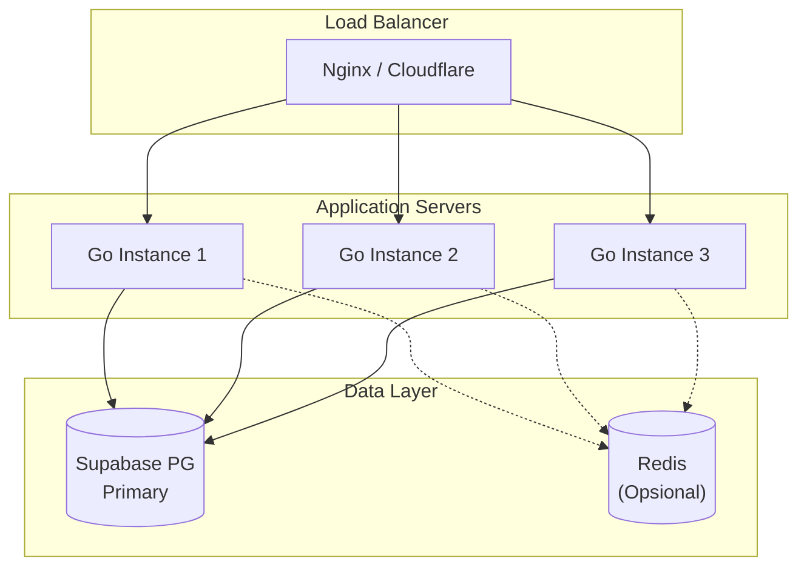

### 10.2 Caching Strategy (Future)

| Layer | Cache Key | TTL | Invalidation |
|-------|-----------|-----|--------------|
| **User Profile** | `user:{user_id}` | 5 menit | On update |
| **Todo List** | `todos:{user_id}:{filter_hash}` | 1 menit | On create/update/delete |
| **Tag List** | `tags:{user_id}` | 10 menit | On create/update/delete |

---

## 11. Testing Strategy

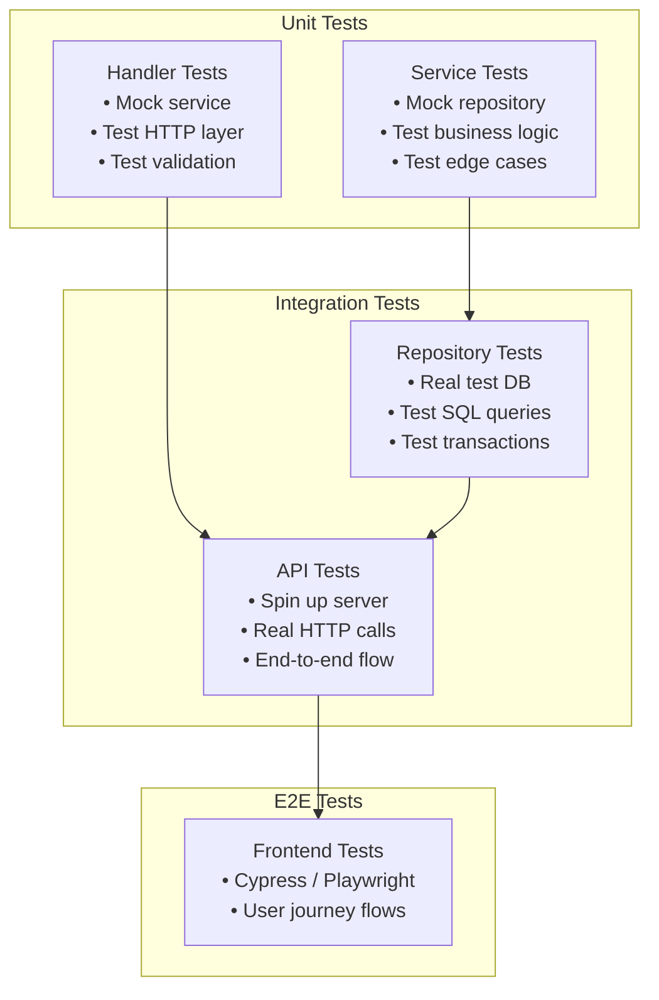

| Tipe Test | Scope | Tools |
|-----------|-------|-------|
| **Unit Test** | Service layer (mock repo), Handler layer (mock service) | testify, mockery |
| **Integration Test** | Repository layer (test DB), API layer (test server) | testify, testcontainers-go |
| **E2E Test** | Full user journey (opsional) | Playwright / Cypress |

---

## 12. Monitoring & Observability (Future)

| Aspek | Tool | Deskripsi |
|-------|------|-----------|
| **Logging** | Structured JSON logs | Zap / Logrus dengan request ID |
| **Metrics** | Prometheus + Grafana | Request rate, latency, error rate |
| **Tracing** | OpenTelemetry / Jaeger | Distributed tracing untuk debug |
| **Health Check** | `/health` endpoint | Liveness & readiness probes |
| **Alerting** | PagerDuty / Slack | Alert untuk error rate > threshold |
