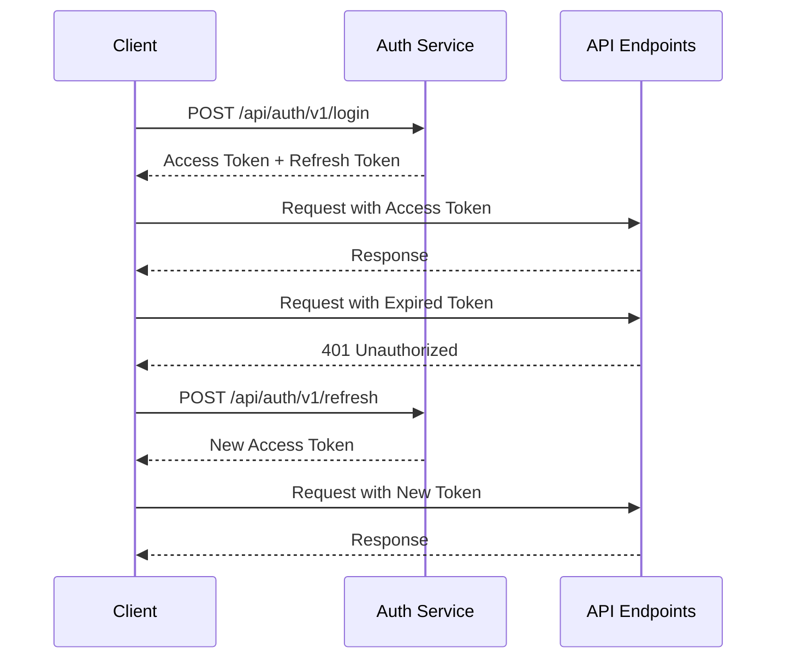
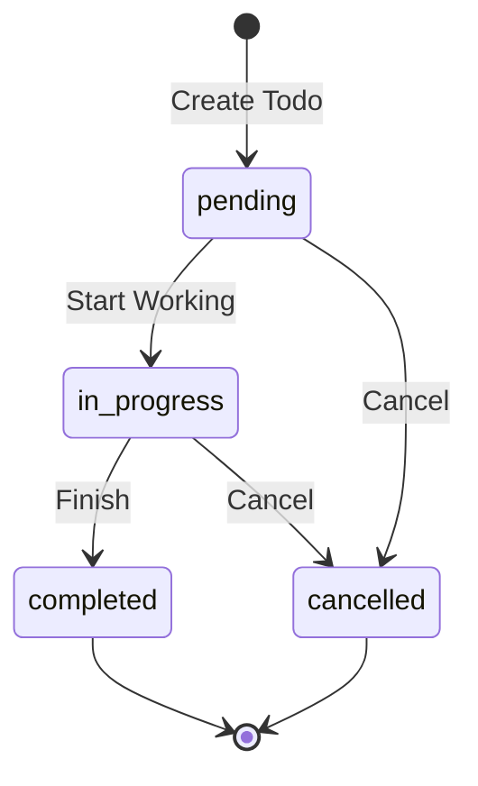

# Donezo — API Contract Summary

## 1. Base URL

```
{BASE_URL}/api/{group-service}/v1/{resource}
```

| Environment | Base URL |
|-------------|----------|
| Local | `http://localhost:8080` |
| Staging | `https://api-staging.donezo.app` |
| Production | `https://api.donezo.app` |

### 1.1 Service Groups

| Group | Base Path | Deskripsi |
|-------|-----------|-----------|
| **Auth** | `/api/auth/v1` | Autentikasi pengguna |
| **Users** | `/api/users/v1` | Manajemen profil pengguna |
| **Todos** | `/api/todos/v1` | Manajemen tugas |
| **Tags** | `/api/tags/v1` | Manajemen label/kategori |

---

## 2. Response Envelope

### 2.1 Success Response

Setiap response sukses mengikuti format berikut:

```json
{
  "message": "string",
  "code": 200,
  "result": {}
}
```

| Field | Type | Deskripsi |
|-------|------|-----------|
| `message` | string | Pesan sukses yang deskriptif |
| `code` | int | HTTP status code |
| `result` | object | Data hasil operasi (bisa object, array, atau null) |

### 2.2 Error Response

Setiap response error mengikuti format berikut:

```json
{
  "message": "string",
  "code": 400,
  "error": "string"
}
```

| Field | Type | Deskripsi |
|-------|------|-----------|
| `message` | string | Pesan error yang user-friendly |
| `code` | int | HTTP status code |
| `error` | string | Detail error (bisa error message atau error code) |

### 2.3 Pagination Metadata

Untuk endpoint yang mengembalikan list/collection, `result` akan berisi `data` dan `metadata`:

```json
{
  "message": "Todos retrieved successfully",
  "code": 200,
  "result": {
    "data": [
      { "id": "uuid", "title": "..." }
    ],
    "metadata": {
      "current_page": 1,
      "page_size": 10,
      "total_pages": 10,
      "total_records": 100,
      "has_next": true,
      "has_prev": false
    }
  }
}
```

#### Pagination Metadata Fields

| Field | Type | Deskripsi |
|-------|------|-----------|
| `current_page` | int | Halaman saat ini |
| `page_size` | int | Jumlah item per halaman |
| `total_pages` | int | Total halaman yang tersedia |
| `total_records` | int | Total seluruh record |
| `has_next` | boolean | Apakah ada halaman berikutnya |
| `has_prev` | boolean | Apakah ada halaman sebelumnya |

### 2.4 Pagination Query Parameters

| Parameter | Type | Default | Deskripsi |
|-----------|------|---------|-----------|
| `page` | int | `1` | Nomor halaman yang diminta |
| `page_size` | int | `10` | Jumlah item per halaman (max: 100) |

---

## 3. HTTP Status Codes

| Code | Status | Penggunaan |
|------|--------|------------|
| `200` | OK | GET request sukses |
| `201` | Created | POST request sukses (resource baru dibuat) |
| `204` | No Content | DELETE request sukses (tidak ada body response) |
| `400` | Bad Request | Validation error, format request salah |
| `401` | Unauthorized | Token tidak ada, invalid, atau expired |
| `403` | Forbidden | Token valid tapi tidak punya akses ke resource |
| `404` | Not Found | Resource tidak ditemukan |
| `409` | Conflict | Resource sudah ada (misal: email duplicate) |
| `422` | Unprocessable Entity | Business rule violation |
| `429` | Too Many Requests | Rate limit exceeded |
| `500` | Internal Server Error | Server error yang tidak terduga |

---

## 4. Authentication

### 4.1 JWT Bearer Token

Semua endpoint (kecuali auth public) memerlukan token JWT di header:

```
Authorization: Bearer <access_token>
```

### 4.2 Token Flow



### 4.3 Token Specification

| Token | TTL (Local) | TTL (Staging) | TTL (Production) | Storage |
|-------|-------------|---------------|------------------|---------|
| **Access Token** | 24 jam | 1 jam | 15 menit | Client memory/localStorage |
| **Refresh Token** | 7 hari | 1 hari | 7 hari | HTTP-only cookie / secure storage |

---

## 5. Endpoint Groups Summary

### 5.1 Auth Endpoints

| Method | Path | Auth | Deskripsi |
|--------|------|------|-----------|
| `POST` | `/api/auth/v1/register` | Public | Registrasi akun baru |
| `POST` | `/api/auth/v1/login` | Public | Login dan dapatkan token |
| `POST` | `/api/auth/v1/refresh` | Refresh Token | Dapatkan access token baru |
| `POST` | `/api/auth/v1/logout` | Bearer | Logout dan invalidate token |

### 5.2 User Endpoints

| Method | Path | Auth | Deskripsi |
|--------|------|------|-----------|
| `GET` | `/api/users/v1/profile` | Bearer | Lihat profil pengguna |
| `PUT` | `/api/users/v1/profile` | Bearer | Update profil pengguna |

### 5.3 Todo Endpoints

| Method | Path | Auth | Deskripsi |
|--------|------|------|-----------|
| `POST` | `/api/todos/v1/` | Bearer | Buat todo baru |
| `GET` | `/api/todos/v1/` | Bearer | List todo (dengan filter & pagination) |
| `GET` | `/api/todos/v1/:id` | Bearer | Detail todo |
| `PUT` | `/api/todos/v1/:id` | Bearer | Update todo |
| `DELETE` | `/api/todos/v1/:id` | Bearer | Hapus todo |

### 5.4 Sub-task Endpoints

| Method | Path | Auth | Deskripsi |
|--------|------|------|-----------|
| `POST` | `/api/todos/v1/:id/sub-tasks` | Bearer | Tambah sub-task |
| `GET` | `/api/todos/v1/:id/sub-tasks` | Bearer | List sub-task |
| `PUT` | `/api/todos/v1/:id/sub-tasks/:subTaskId` | Bearer | Update sub-task |
| `DELETE` | `/api/todos/v1/:id/sub-tasks/:subTaskId` | Bearer | Hapus sub-task |

### 5.5 Tag Endpoints

| Method | Path | Auth | Deskripsi |
|--------|------|------|-----------|
| `POST` | `/api/tags/v1/` | Bearer | Buat tag baru |
| `GET` | `/api/tags/v1/` | Bearer | List tag |
| `PUT` | `/api/tags/v1/:id` | Bearer | Update tag |
| `DELETE` | `/api/tags/v1/:id` | Bearer | Hapus tag |
| `POST` | `/api/todos/v1/:id/tags` | Bearer | Assign tag ke todo |
| `DELETE` | `/api/todos/v1/:id/tags/:tagId` | Bearer | Hapus tag dari todo |

---

## 6. Filter & Search Specification (Todo List)

### 6.1 Query Parameters

| Parameter | Type | Default | Deskripsi | Contoh |
|-----------|------|---------|-----------|--------|
| `page` | int | `1` | Nomor halaman | `?page=2` |
| `page_size` | int | `10` | Jumlah per halaman (max 100) | `?page_size=20` |
| `status` | string | - | Filter by status | `?status=completed` |
| `priority` | string | - | Filter by priority | `?priority=high` |
| `tag_id` | uuid | - | Filter by tag | `?tag_id=uuid` |
| `search` | string | - | Search by title | `?search=meeting` |
| `due_date_from` | date | - | Filter due date mulai | `?due_date_from=2026-04-01` |
| `due_date_to` | date | - | Filter due date sampai | `?due_date_to=2026-04-30` |
| `sort_by` | string | `created_at` | Sort field | `?sort_by=due_date` |
| `sort_order` | string | `desc` | Sort direction | `?sort_order=asc` |

### 6.2 Sortable Fields

| Field | Deskripsi |
|-------|-----------|
| `created_at` | Waktu pembuatan |
| `updated_at` | Waktu terakhir diperbarui |
| `due_date` | Tanggal jatuh tempo |
| `priority` | Tingkat prioritas |
| `title` | Judul todo |

### 6.3 Filter Combinations

Filter dapat dikombinasikan:

```
GET /api/todos/v1/?status=pending&priority=high&search=urgent&page=1&page_size=10&sort_by=due_date&sort_order=asc
```

---

## 7. Common Request/Response Patterns

### 7.1 Create Pattern

**Request:**
```http
POST /api/todos/v1/
Authorization: Bearer <token>
Content-Type: application/json

{
  "title": "Complete project documentation",
  "description": "Write API docs and architecture overview",
  "priority": "high",
  "due_date": "2026-05-01T17:00:00Z"
}
```

**Response (201):**
```json
{
  "message": "Todo created successfully",
  "code": 201,
  "result": {
    "id": "550e8400-e29b-41d4-a716-446655440000",
    "title": "Complete project documentation",
    "description": "Write API docs and architecture overview",
    "status": "pending",
    "priority": "high",
    "due_date": "2026-05-01T17:00:00Z",
    "created_at": "2026-04-26T20:50:00Z",
    "updated_at": "2026-04-26T20:50:00Z"
  }
}
```

### 7.2 List Pattern

**Request:**
```http
GET /api/todos/v1/?page=1&page_size=10&status=pending
Authorization: Bearer <token>
```

**Response (200):**
```json
{
  "message": "Todos retrieved successfully",
  "code": 200,
  "result": {
    "data": [
      {
        "id": "550e8400-e29b-41d4-a716-446655440000",
        "title": "Complete project documentation",
        "status": "pending",
        "priority": "high",
        "due_date": "2026-05-01T17:00:00Z",
        "created_at": "2026-04-26T20:50:00Z"
      }
    ],
    "metadata": {
      "current_page": 1,
      "page_size": 10,
      "total_pages": 5,
      "total_records": 50,
      "has_next": true,
      "has_prev": false
    }
  }
}
```

### 7.3 Error Pattern

**Response (400):**
```json
{
  "message": "Validation failed",
  "code": 400,
  "error": "title is required and must be at least 3 characters"
}
```

**Response (401):**
```json
{
  "message": "Unauthorized",
  "code": 401,
  "error": "invalid or expired token"
}
```

**Response (404):**
```json
{
  "message": "Todo not found",
  "code": 404,
  "error": "todo with id 550e8400-e29b-41d4-a716-446655440000 does not exist"
}
```

**Response (409):**
```json
{
  "message": "Conflict",
  "code": 409,
  "error": "email already registered"
}
```

---

## 8. Data Types

### 8.1 Common Types

| Type | Format | Contoh |
|------|--------|--------|
| `UUID` | String (36 chars) | `550e8400-e29b-41d4-a716-446655440000` |
| `TIMESTAMPTZ` | ISO 8601 | `2026-04-26T20:50:00Z` |
| `DATE` | YYYY-MM-DD | `2026-04-26` |
| `Status` | Enum string | `pending`, `in_progress`, `completed`, `cancelled` |
| `Priority` | Enum string | `low`, `medium`, `high`, `urgent` |
| `HexColor` | String (7 chars) | `#3B82F6` |

### 8.2 Todo Status Lifecycle



---

## 9. Rate Limiting

| Endpoint Group | Limit | Window |
|----------------|-------|--------|
| **Auth** (register, login) | 10 requests | 1 menit |
| **Auth** (refresh) | 20 requests | 1 menit |
| **General API** | 60-120 requests | 1 menit |

Response ketika rate limit terlampaui:

```json
{
  "message": "Too many requests",
  "code": 429,
  "error": "rate limit exceeded, retry after 45 seconds"
}
```

---

## 10. Versioning Strategy

API menggunakan **URL path versioning**:

```
/api/{group}/v1/{resource}
```

| Versi | Status | Deskripsi |
|-------|--------|-----------|
| `v1` | Current | Versi aktif yang sedang dikembangkan |
| `v2` | Future | Versi berikutnya (jika ada breaking changes) |

**Prinsip Versioning:**
- Breaking changes (perubahan response structure, penghapusan field) → versi baru
- Non-breaking changes (penambahan field, penambahan endpoint) → tetap di versi yang sama
- Deprecation: endpoint lama di-mark deprecated selama 3-6 bulan sebelum dihapus

---

## 11. Next Steps: API Contract Detail

Setelah API Contract Summary ini disetujui, dokumentasi detail per endpoint akan mencakup:

1. **Auth Endpoints Detail**
   - Request body schema dengan validation rules
   - Response examples (success & all error cases)
   - Token format & claims

2. **User Endpoints Detail**
   - Profile fields & update rules
   - Avatar upload flow (future)

3. **Todo Endpoints Detail**
   - Complete CRUD with all fields
   - Filter combinations & behavior
   - Bulk operations

4. **Sub-task Endpoints Detail**
   - Nested resource operations
   - Completion toggle behavior

5. **Tag Endpoints Detail**
   - Tag CRUD
   - Todo-Tag association operations

Setiap endpoint detail akan berisi:
- HTTP method & full path
- Authentication requirements
- Request headers
- Request body (with JSON schema)
- Query parameters
- Response body (success & error)
- Example requests (cURL)
